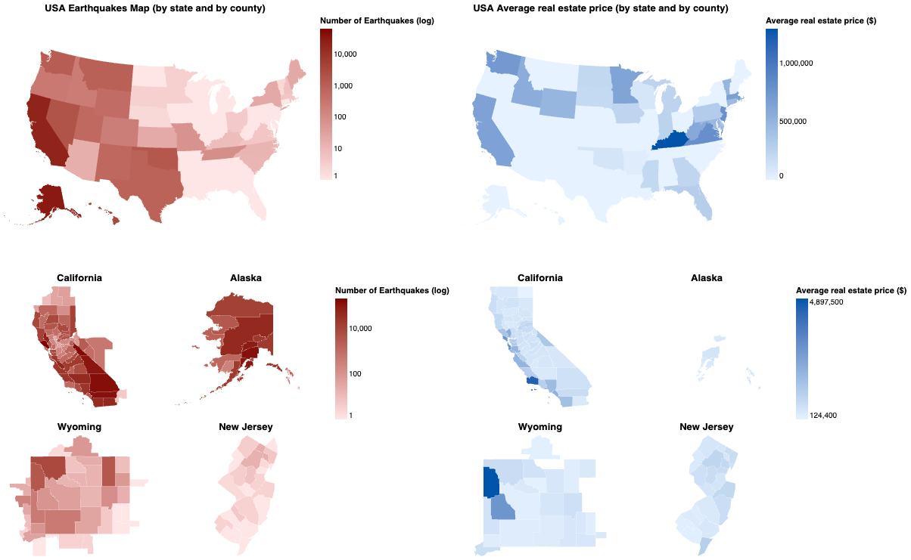
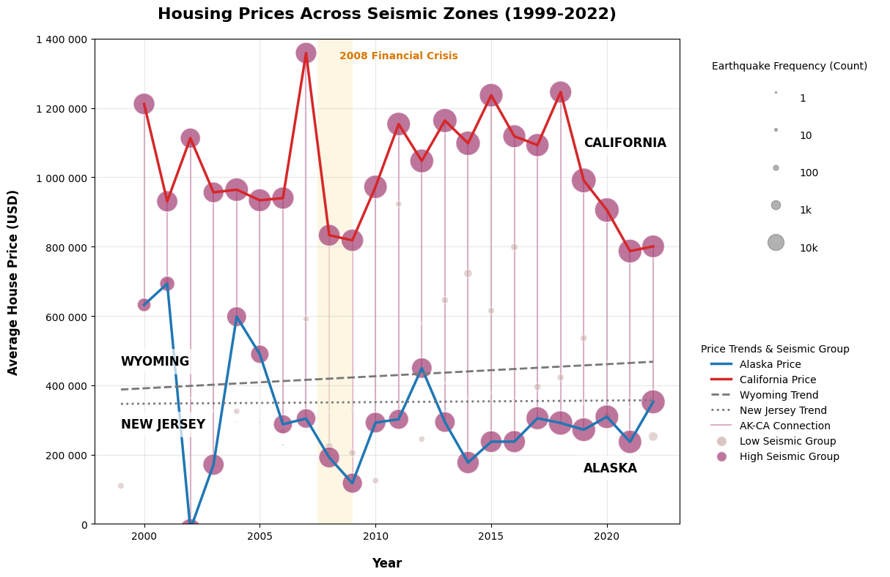
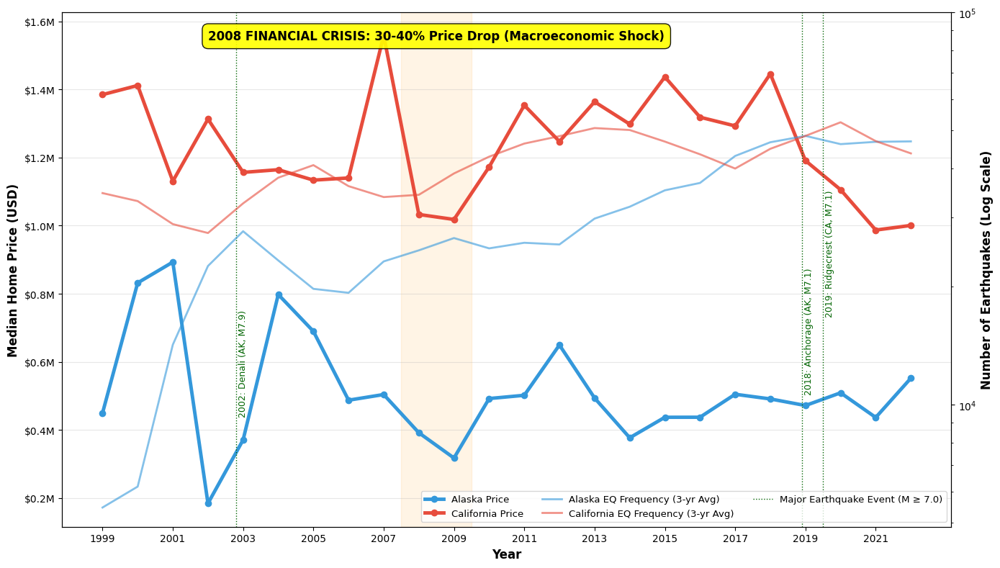

# 📉 Seismic Shocks vs. Market Shocks
### Do earthquakes influence housing prices? (Alaska vs. California)

  

> **The Insight:** Despite frequent and intense seismic activity, housing prices in high-risk zones are driven by national economic trends (urbanization, 2008 crisis), not by ground motion.

---

## 📖 Project Overview

This project investigates the relationship between seismic activity and real estate market trends over a 33-year period (1999-2022). By analyzing data from the **USGS** and **Zillow**, we aimed to determine if natural disasters dictate housing values or if macroeconomic factors play a larger role.

**Key Question:** *Does the frequency of earthquakes correlate with a drop in housing prices in Alaska and California?*

---

## 📊 Phase 1: Visual Data Exploration (B.1)

We started by exploring the spatial and temporal dimensions of the data to find patterns.

### 1. Spatial Context & The "Ring of Fire"
We mapped seismic activity against housing prices. While California and Alaska account for 95% of US seismic energy, we observed that the most expensive counties (e.g., San Francisco) are often in high-risk zones, suggesting a decoupling of risk and price.

*Fig 1: Spatial multi-scale earthquake and real-estate comparison.*

### 2. Temporal Dynamics & The "Control Group"
We used small multiples to compare AK and CA against "stable" states (Wyoming, New Jersey).
* **Observation:** Alaska's earthquakes quintupled between 2020-2022 without affecting price trends.
* **Observation:** The only synchronized drop in prices across all states corresponds to the 2008 Financial Crisis (vertical dashed line).

*Fig 2: Temporal trends via small multiples (1999-2022).*

### 3. Event Impact Analysis
We overlaid earthquake frequency bubbles on price lines. This view confirms that economic shocks (2008) dwarf seismic shocks. Even major events ($M \ge 7.0$) show no visible negative impact on the price curve.

*Fig 3: Individual seismic events overlaid on price trajectories.*

---

## 💡 Phase 2: Visual Insight Communication (B.2)

After the exploration phase, we synthesized our findings into a final infographic designed for communication.

### The Verdict: Macroeconomics > Geophysics
Our visual analysis decisively rejects the earthquake-price influence hypothesis.

*Fig 4: Final Communication Artifact - "Seismic Shocks vs. Market Shocks".*

### Key Metrics
| Relationship | Correlation (Pearson's r) | Interpretation |
| :--- | :--- | :--- |
| **Earthquakes vs. Price** | `r = -0.15` | **Insignificant** |
| **Urbanization vs. Price** | `r = 0.78` | **Strong Correlation** |

**Conclusion:** The 2008 Financial Crisis caused a **30-40% price drop**, whereas major earthquakes resulted in **<1% volatility**.

---

## 🛠 Methodology & Tools

* **Data Processing:** Python (Pandas) for time-series alignment and correlation analysis.
* **Visualization:** Matplotlib & Seaborn for exploration; Adobe Illustrator/Inkscape for final polishing.
* **Data Sources:**
    * USGS Earthquake Catalog (1990-2023)
    * Zillow Home Value Index (ZHVI)
    * US Census Bureau TIGER/Line Shapefiles

---

## 📝 Course Context

Click to expand assignment details (MSE TSM InfVis AUT25)

**Course:** MSE TSM InfVis AUT25 - Information Visualization  
**Authors:** Arno Wilhelm, Audrey Blein  
**Date:** December 2025

**Module Task Requirements:**
The goal was to complete a visualization project on a selected topic with at least four data dimensions (Space, Time, Attributes).

* **Part B.1 (Exploration):** Visual exploration of data to find insights, checking correlations and verifying hypotheses (MAUP, Event studies).
* **Part B.2 (Communication):** A standalone information graphic communicating non-trivial insights using Gestalt principles and storytelling techniques.

